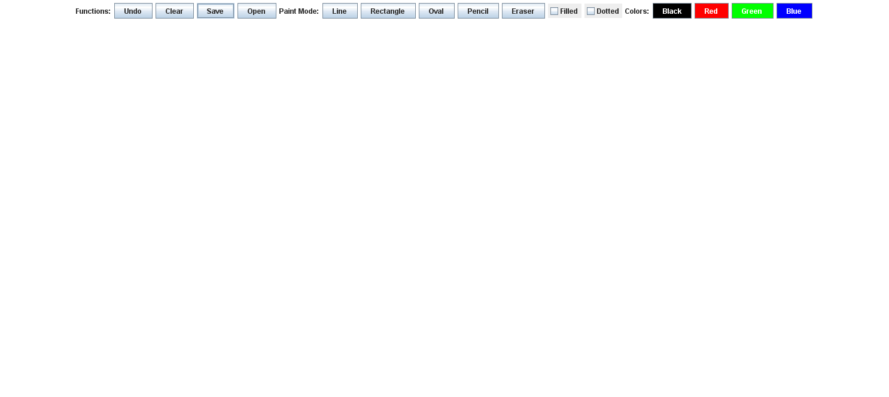

# Simple Paint Application

A basic drawing application built with Java , inspired by classic Microsoft Paint but with a simplified interface.

This project provides a toolbar with essential drawing tools, shapes, color selection, and canvas functions, allowing users to create freehand drawings, lines, rectangles, ovals, and more.

  

## Features

- **Drawing Tools**: Pencil (freehand), Line, Rectangle, Oval
- **Eraser**: Erase parts of the drawing
- **Color Selection**: Black, Red, Green, Blue
- **Shape Options**: Filled shapes or outline only, Dotted lines
- **Canvas Functions**: 
  - Undo last action
  - Clear the entire canvas
  - Save drawing to file
  - Open previously saved drawings
